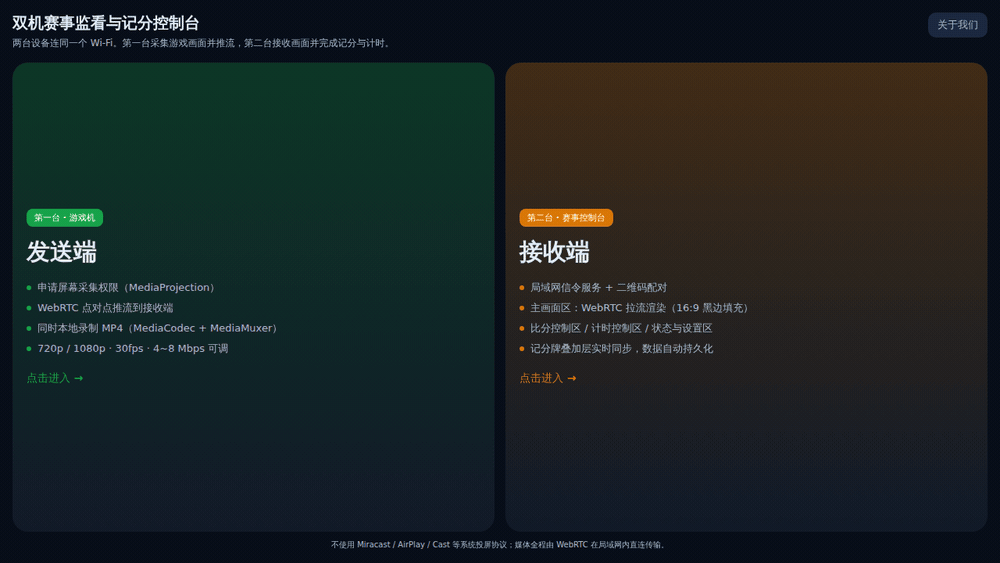
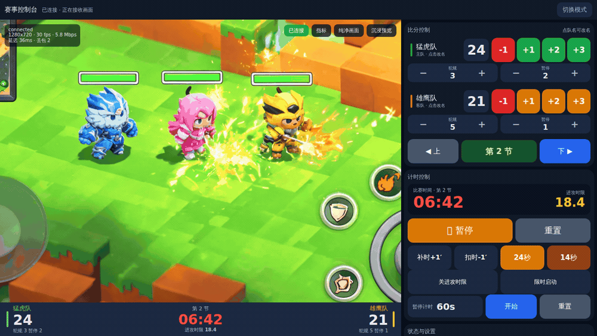
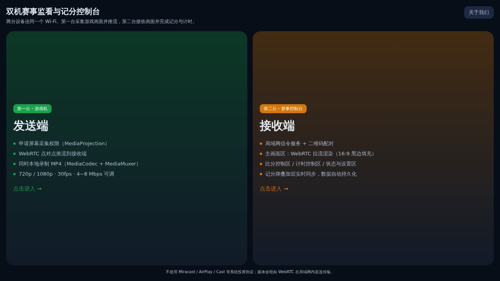
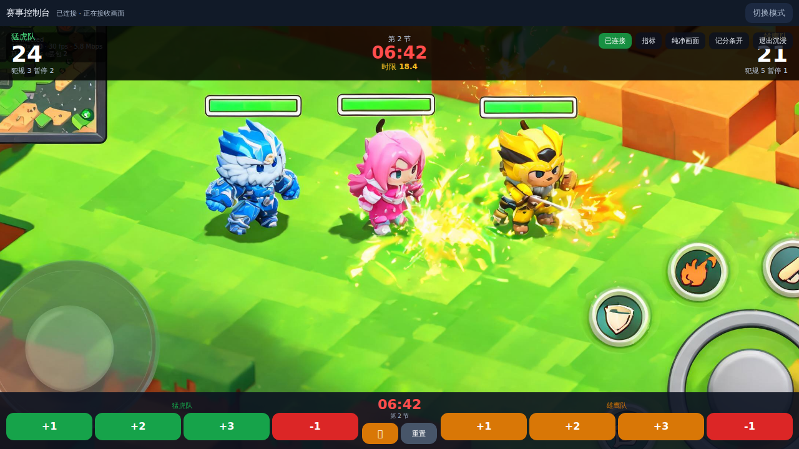
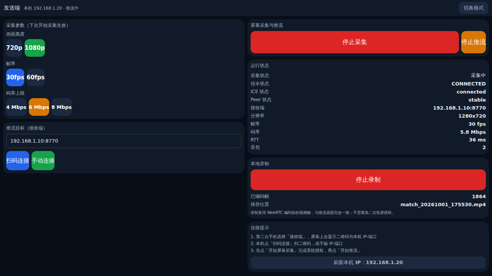

<div align="center">

# 双机赛事监看与记分控制台 · MatchConsole

**两台 Android 手机连同一个 Wi-Fi，就是一套赛事导播台 + 记分台。**

第一台采集画面并推流，第二台收画面、记比分、控计时 —— 全程局域网直连，不依赖公网。


</div>

---

## 目录

- [这是什么](#这是什么)
- [功能演示](#功能演示)
- [界面预览](#界面预览)
- [核心特性](#核心特性)
- [快速开始](#快速开始)
- [一键安装](#一键安装)
- [使用流程](#使用流程)
- [项目结构](#项目结构)
- [技术架构](#技术架构)
- [构建与发布](#构建与发布)
- [中文文档](#中文文档)
- [常见问题](#常见问题)
- [许可协议](#许可协议)

---

## 这是什么

MatchConsole 是一套面向线下小型赛事的**双机监看与记分方案**，把「导播」和「记分」拆到两台手机上：

| 设备 | 角色 | 干什么 |
| --- | --- | --- |
| 第一台（游戏机 / 主机） | **发送端** | MediaProjection 采集屏幕 → WebRTC 点对点推流 → 同时本地录制成 MP4 |
| 第二台（监看 / 记分） | **接收端** | WebRTC 拉流渲染 + 赛事控制台（主画面 / 比分 / 计时 / 状态四个区域） |

不使用 Miracast / AirPlay / Cast 等系统投屏协议，不做系统分屏、悬浮窗、小窗。
媒体走 WebRTC P2P，局域网直连，**不配置 STUN/TURN，不依赖公网**。

---

## 功能演示

### 1. 三步连起来（模式选择 → 扫码配对 → 收到画面）



> 第二台选「接收端」显示二维码；第一台选「发送端」扫码或手输 `IP:端口`，开始采集后即可开始推流。

### 2. 记分牌实时联动



> 点 `+1 / +2 / +3 / -1` 记分，主画面下方的记分牌横条与右侧比分**即时同步**，比分变化带高亮反馈。

### 3. 沉浸预览与零遮挡


> 点「沉浸预览」主画面铺满整屏；再点「记分条关」可隐藏底部快捷记分条，**画面上零遮挡**，只留推流画面本身。

---

## 界面预览

| 模式选择 | 接收端控制台 |
| --- | --- |
|  |  |

| 沉浸预览 | 发送端 |
| --- | --- |
|  |  |

---

## 核心特性

### 接收端 · 赛事控制台

- **四区域布局**：主画面区 / 比分控制区 / 计时控制区 / 状态与设置区，横屏一屏操作。
- **比分控制**：点击队名即可改名；每队 `+1 / +2 / +3 / -1`；节次 `上/下` 切换；犯规、暂停 `+/-` 步进。
- **计时控制**：大字号比赛时间、开始 / 暂停 / 重置、进攻时限倒数与开关、暂停计时、补时扣时。
- **记分牌横条**：位于**推流画面下方**的独立横条，**不遮挡画面**；可一键开关。
- **沉浸预览**：主画面铺满整屏，画面顶部叠加记分牌，底部快捷记分条支持隐藏（零遮挡）。
- **纯净画面**：一键屏蔽所有浮层（记分牌、链路指标、连接角标、快捷条）。
- **画面缩放**：适配（完整可见，可能留黑边）/ 裁切（铺满，边缘会被切掉）。
- **本地持久化**：比分、队名、节次、主题等经 DataStore 保存，App 重启恢复上一场。

### 发送端

- 屏幕采集（MediaProjection）+ WebRTC 推流，**前台服务**保障切后台 / 锁屏不中断。
- 分辨率 `720p / 1080p`、帧率 `30 / 60 fps`、码率上限 `4 / 6 / 8 Mbps` 可调。
- **同时本地录屏**输出 MP4：复用 WebRTC 编码前的视频帧，**不需要二次投屏授权**，录制内容与推流画面完全一致。
- 显示本机 IP，支持**扫码连接**或手输 `IP:端口`。

### 通用

- 局域网自实现 TCP 信令，扫码即连；横屏锁定；Android 10+（minSdk 29）。
- 浅色 / 深色主题；实时链路指标（ICE / Peer 状态、RTT、丢包、码率）。

---

## 快速开始

### 环境要求

- 两台 **Android 10（API 29）及以上**手机，连接**同一个 Wi-Fi**（同一网段，勿开 AP 隔离）。
- 首次进接收端需授予「通知」权限；发送端还需「相机」（扫码）与「屏幕采集」授权。

### 安装方式二选一

1. **一键安装脚本**（见下一节）：已连接 `adb` 时直接装好。
2. **手动安装**：从 [Releases](https://github.com/XIAWAN-PROMAX/Event-console/releases) 下载 APK，
   或按 [构建与发布](docs/build-and-release.md) 自行构建后 `adb install -r app-debug.apk`。

---

## 一键安装

仓库提供一键安装脚本，自动拉取最新 Release 的 APK 并安装到已连接的设备（两台手机依次插上执行即可）。

**Linux / macOS**

```bash
curl -fsSL https://raw.githubusercontent.com/XIAWAN-PROMAX/Event-console/main/install.sh | bash
```

或下载后执行：

```bash
chmod +x install.sh && ./install.sh
```

**Windows（PowerShell）**

```powershell
irm https://raw.githubusercontent.com/XIAWAN-PROMAX/Event-console/main/install.bat -OutFile install.bat ; .\install.bat
```

脚本会依次：检测 `adb` → 下载最新 Release APK → 安装到当前连接的设备。
若本机已有本地构建产物，也可直接指定：

```bash
./install.sh --apk ./app/build/outputs/apk/debug/app-debug.apk
```

> 需要先安装 [Android Platform Tools](https://developer.android.com/tools/releases/platform-tools)，并在手机上开启「USB 调试」。

---

## 使用流程

### 第一步 · 接收端（第二台）

1. 打开 App → 选 **接收端**，首次授予「通知」权限。
2. App 自动启动局域网信令服务，**状态与设置区**显示本机 `IP:端口`（默认 `8770`）与二维码。
3. 界面即控制台：中央主画面 + 下方记分牌横条，右侧比分 / 计时 / 状态。

### 第二步 · 发送端（第一台）

1. 打开 App → 选 **发送端**，首次授予「相机」「通知」权限。
2. 选采集参数：`720p / 1080p`、`30 / 60 fps`、码率上限 `4 / 6 / 8 Mbps`（下次开始采集生效）。
3. 连接接收端：点 **扫码连接** 扫第二台二维码，或手输 `192.168.x.x:8770`。
4. 点 **开始屏幕采集** → 系统弹投屏授权 → 允许（此后进入 `mediaProjection` 前台服务）。
5. 点 **开始推流**；需要留档时点 **开始录制到 MP4**。

### 第三步 · 接收端记分

| 区域 | 操作 |
| --- | --- |
| 主画面区 | 16:9 等比适配；右上角「沉浸预览 / 指标 / 纯净画面」开关 |
| 比分控制区 | 点队名改名；每队 `+1 / +2 / +3 / -1`；节次切换；犯规、暂停 `+/-` |
| 计时控制区 | 比赛时间开始 / 暂停 / 重置；进攻时限；暂停计时；补时 |
| 状态与设置区 | 连接状态、二维码、分辨率/帧率/码率、记分牌开关、主题、录制、重置比赛 |

> 所有改动即时同步到记分牌并持久化，App 重启后恢复上一场。

---

## 项目结构

```
Event-console/
├── settings.gradle.kts                 仓库与模块声明
├── build.gradle.kts                    顶层插件
├── gradle.properties                   JVM/AndroidX/BuildConfig 开关
├── gradle/libs.versions.toml           版本目录（依赖与插件集中管理）
├── install.sh / install.bat            一键安装脚本
├── docs/                               中文文档与演示资源
└── app/src/main/
    ├── AndroidManifest.xml             权限 + 单 Activity + 前台服务声明
    └── java/com/matchconsole/
        ├── MatchConsoleApp.kt          Application：初始化 WebRTC、通知渠道
        ├── MainActivity.kt             单 Activity，Compose 路由
        ├── app/ModeSelectScreen.kt     模式选择页
        ├── common/                     跨模块基础设施
        │   ├── WebRtcCore.kt           PeerConnectionFactory / EglBase / 渲染器工厂
        │   ├── ScreenRecorder.kt       复用视频帧的 MP4 录制器（MediaCodec + MediaMuxer）
        │   ├── LinkStats.kt            链路指标
        │   ├── NetUtils.kt             本机 IPv4、连接串解析
        │   ├── QrCodeUtils.kt          ZXing 二维码生成
        │   ├── Notifications.kt        通知渠道 + 前台服务通知
        │   ├── PermissionUtils.kt      运行时权限
        │   └── Logx.kt                 统一日志
        ├── signaling/                  局域网信令（自实现 TCP）
        │   ├── SignalingMessage.kt     信令消息模型 + 换行 JSON 编解码
        │   ├── SignalingServer.kt      接收端：监听、收发、连接状态流
        │   └── SignalingClient.kt      发送端：连接、收发、重连
        ├── sender/                     发送端
        │   ├── SenderController.kt     总协调器：状态机、信令与 Peer 编排
        │   ├── ScreenCaptureService.kt mediaProjection 前台服务
        │   ├── SenderPeer.kt           采集 + 建轨 + Offer/Answer + ICE + SDP 改码率
        │   ├── SenderScreen.kt         发送端 Compose 界面
        │   └── QrScanScreen.kt         CameraX + MLKit 扫码页
        ├── receiver/                   接收端
        │   ├── ReceiverSession.kt      总协调器：信令服务、建 Peer、回 Answer、挂渲染器
        │   └── ReceiverScreen.kt       接收端外壳
        ├── scoreboard/                 记分牌
        │   ├── ScoreboardModels.kt     比赛数据模型
        │   ├── ScoreboardRepository.kt DataStore 持久化
        │   ├── ScoreboardViewModel.kt  状态机 + 状态投影
        │   └── ScoreboardOverlay.kt    记分牌横条 + 叠加层 + 快捷条
        └── console/                    控制台 UI
            ├── ConsoleScreen.kt        四区域装配
            ├── ConsoleTheme.kt         主题与队色
            ├── ConsoleWidgets.kt       通用组件
            ├── VideoPane.kt            主画面 + 浮层
            ├── ScoreControlPane.kt     比分控制区
            ├── TimerControlPane.kt     计时控制区
            └── StatusPane.kt           状态与设置区
```

---

## 技术架构

| 层 | 选型 |
| --- | --- |
| 界面 | Jetpack Compose + Material3（横屏锁定） |
| 媒体 | WebRTC `io.github.webrtc-sdk:android` |
| 信令 | 自实现 TCP + 换行 JSON（`hello / offer / answer / ice / bye`） |
| 录制 | MediaCodec（H.264）+ MediaMuxer，复用 WebRTC 编码前帧 |
| 持久化 | Jetpack DataStore |
| 扫码 | CameraX + MLKit；二维码生成 ZXing |

### 两个关键设计

1. **只申请一次屏幕投影**：Android 14 起同一个 `MediaProjection` 只允许 `createVirtualDisplay()` 一次。
   因此本地录制没有用第二个 `MediaRecorder`，而是把 `ScreenRecorder` 作为 `VideoSink` 挂到 WebRTC 视频轨，
   直接吃编码前的 I420 帧 —— 零额外投影、无二次弹窗、录制内容与推流完全一致。

2. **重组范围收敛（性能关键）**：记分牌计时器 100ms 更新一次状态。若 UI 直接订阅整个 `ScoreboardState`，
   含 `SurfaceViewRenderer` 的 `AndroidView` 会跟着 10Hz 重组，主画面必然卡顿。
   因此 `ScoreboardViewModel` 按「变化频率」把状态投影成四条独立流：

   | 流 | 频率 | 订阅者 |
   | --- | --- | --- |
   | `clock` | 100ms | 记分牌计时读数（叶子节点） |
   | `clockFlags` | 点击级 | 计时按钮文案 |
   | `scores` | 点击级 | 比分控制区、比分叠加层 |
   | `layout` | 点击级 | 控制台布局、主题、开关 |

   每条都经 `distinctUntilChanged`，控制台顶层与主画面容器**不订阅** `clock`，
   所以计时数字跳动时只重组那几个 `Text`，视频画面与按钮完全不受影响。

更多细节见 [架构说明](docs/architecture.md)。

---

## 构建与发布

### 环境要求

- JDK **17**
- Android SDK：`platforms;android-35`、`build-tools;35.0.0`、`platform-tools`
- Gradle 8.9+（仓库 wrapper 指向 8.11.1）

### 命令行构建

```bash
export JAVA_HOME=<你的 JDK17 路径>
export ANDROID_HOME=<你的 Android SDK 路径>
echo "sdk.dir=$ANDROID_HOME" > local.properties

./gradlew :app:assembleDebug        # 产物：app/build/outputs/apk/debug/app-debug.apk
./gradlew :app:assembleRelease      # 产物：app/build/outputs/apk/release/app-release.apk
```

> debug 包与 release 包使用**不同签名**，无法互相覆盖安装；切换时需先卸载。

发布包签名读取仓库根目录的 `keystore.properties`（**该文件与 `.jks` 已被 `.gitignore` 忽略，不进仓库**）：

```properties
storeFile=matchconsole-release.jks
storePassword=<你的密码>
keyAlias=matchconsole
keyPassword=<你的密码>
```

完整说明见 [构建与发布](docs/build-and-release.md)。

---

## 中文文档

| 文档 | 说明 |
| --- | --- |
| [快速开始](docs/getting-started.md) | 环境准备、安装、首次连接 |
| [使用手册](docs/user-guide.md) | 发送端 / 接收端 / 记分牌 / 沉浸预览完整操作 |
| [架构说明](docs/architecture.md) | 模块划分、信令与媒体流程、性能设计 |
| [构建与发布](docs/build-and-release.md) | 环境、命令行构建、签名与发布流程 |
| [常见问题](docs/faq.md) | 连接、画面、录制、崩溃等问题排查 |

---

## 常见问题

| 现象 | 排查 |
| --- | --- |
| 一直「等待连接」 | 两台是否同网段；接收端信令服务是否在跑；防火墙是否拦截 `8770`；IP 是否填错 |
| 一直「建立通道中」 | 是否开了 AP 隔离 / 客户端隔离；关闭 VPN |
| 画面黑屏但已连接 | 发送端是否真的点了「开始推流」；查看发送端 ICE / Peer 状态 |
| 录制文件只有几 KB | 采集未真正出帧；先确认推流正常再录制 |
| Android 14 采集启动即崩 | 确认 `ScreenCaptureService` 的 `foregroundServiceType` 未被改动 |

完整排查见 [常见问题](docs/faq.md)。

---

## 许可协议

本项目基于 **GNU General Public License v3.0** 发布，**不可商用**。详见 [LICENSE](LICENSE)。

---

<div align="center">
<sub>两台手机，一套赛事导播台。 · MatchConsole</sub>
</div>